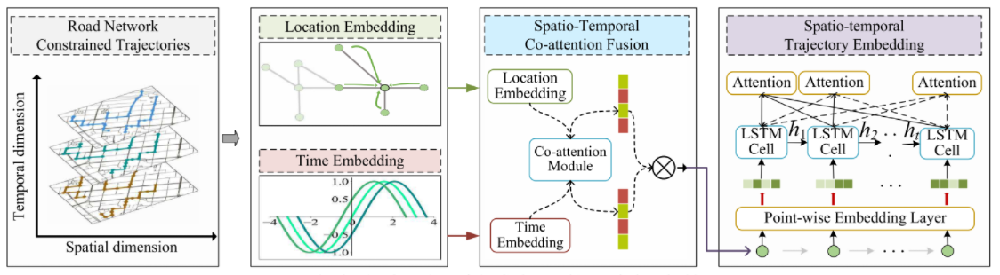
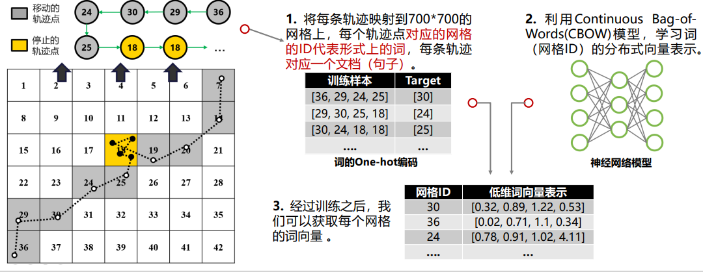

# ST2Vec: Spatio-Temporal Trajectory Similarity Learning in Road Networks

本文提出一种新的基于表示学习的架构，称为ST2Vec，能够利用轨迹中的细粒度时间和空间信息来实现统一的时空相似性学习。

图2显示了ST2Vec的架构和训练方案。

- 需要相似和不相似的锚点轨迹对来构建同时考虑空间(即T(s))和时间(即T(T))维度的输入相似性三元组。
- ST2Vec学习嵌入轨迹，将轨迹映射到低维空间，其过程如图2中的虚线矩形所示。
- 这个过程继续进行，直到在嵌入向量上评估的轨迹相似性(由浅蓝色和浅黄色的立方体表示)近似于由等式1计算的真实相似性(由蓝色和黄色的立方体表示)

为了生成面向时空相似性的嵌入(如图2中带红边的绿色矩形)，必须捕获轨迹中的时间和空间信息，并以统一的方式融合这些信息。为此，STVec具有3个主要模块，即时间建模模块(TMM)、空间建模模块(SMM)和时空协同注意力融合模块(STCF)。下面介绍了这些模块。这种具有三个模块的设计，可以用任何现有的空间相似性学习模块替换SMM，以实现时空感知的相似性学习。

# 抽样-哈希碰撞算法（RS-HCD）

## 流程

1. ### 对纬经度四舍五入到两位小数，以克服不 同测量体系造成的系统误差

2. ### 对于每个设备聚合得出相应的路径点集合， 以及按时间倒排的轨迹向量 

3. ### 将设备根据时序相似性，用LSH算法分成 sqrt(N) 个桶，再根据空域相似性进一步剪枝， 以减小搜索空间

   > 局部敏感哈希(Locality Sensitive Hashing，LSH)算法,是近似最近邻搜索算法中最流行的一种，它有坚实的理论依据并且在高维数据空间中表现优异。它的主要作用就是从海量的数据中挖掘出相似的数据，可以具体应用到文本相似度检测、网页搜索等领域。
   >
   > ### 基本思想
   >
   > 局部敏感哈希的基本思想类似于一种空间域转换思想，LSH算法基于一个假设，如果两个文本在原有的数据空间是相似的，那么分别经过哈希函数转换以后的它们也具有很高的相似度；相反，如果它们本身是不相似的，那么经过转换后它们应仍不具有相似性。

4. ### 对同个桶中的不同设备，随机抽样部分路 径点，检测哈希碰撞的概率 

   > 设计了一种特殊的hash函数，使得2个相似度很高的数据以较高的概率映射成同一个hash值，而令2个相似度很低的数据以极低的概率映射成同一个hash值。我们把这样的函数，叫做LSH（局部敏感哈希）

5. ### 剔除碰撞概率低于一定值(如0.8)的设备组 合，余下的即匹配结果候选集

6. ### 若候选集有多个组合，则用FDTW算法计算轨迹向量间的最短𝐿1距离，取最小的一组作为最终结果

   

|                        传统方法                         |                        RS-HCD                        |
| :-----------------------------------------------------: | :--------------------------------------------------: |
| 需遍历完整条轨迹，耗时长 匹配完全部渔船轨迹需要较长时间 |               在抽样中动态剪枝，耗时短               |
| 时间复杂度𝑂(𝑁2𝐿 + 𝑁𝐿) N为待匹配轨迹量，L为平均轨迹长度  | 时间复杂度𝑂(𝑁 + 𝑁𝐿) N为待匹配轨迹量，L为平均轨迹长度 |

# 两阶段匹配

1. ### 召回粗排：对于给定待检索的北斗 轨迹，计算与指定时段的每一条AIS 轨迹的Jaccard相似度，取其TOP K 相似轨迹，作为第一步粗排结果

   

2. ### 综合精排：结合每条轨迹的 embedding序列，计算待匹配北 斗轨迹与TOP K的AIS每条轨迹的 World Mover Distance(WMD 距离)进行精排

> ## 轨迹向量化
>
> 
>
> 
>
> ### WMD是Word Mover's Distance的缩写，翻译为词移距离，是度量两个文本文档之间距离的一种方式（方法），用于判断两个文本之间的相似度，即WMD距离越大相似度越小，WMD距离越小文本相似度越大

# 加权算法

